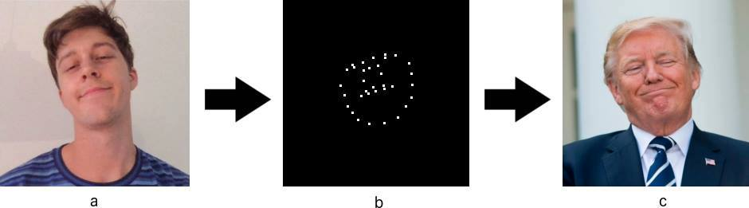
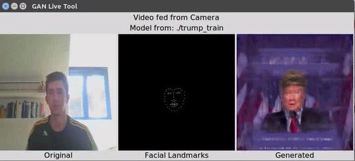
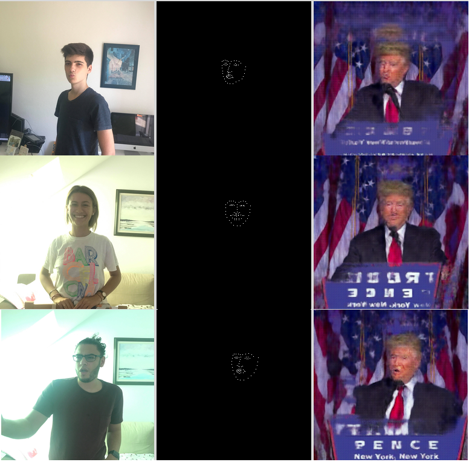

# Transforming Any Human Face

This work is mostly based on [pix2pix by Isola et al. 2017](https://github.com/phillipi/pix2pix), [pix2pix-tensorflow by Christoper Hesse](https://github.com/affinelayer/pix2pix-tensorflow) and [face_recognition by Adam Geitgey](https://github.com/ageitgey/face_recognition).
This work has been done by Matej Zecevic and Robin Hesse as a project in the scope of the course *Deep Learning: Architectures and Methods* by the professors Kersting et al. @ TU Darmstadt.


### Task Definition & Our Solution

Leading question: *"How can we efficiently implement a generative model f that causes the target person to mimic the facial expression for any given image of a human face?"*

Our answer: Use a conditional generative adversarial network [[Goodfellow et al. 2014]](https://arxiv.org/abs/1406.2661),[[Mirza et al. 2014]](https://arxiv.org/abs/1411.1784) and an abstract representation that captures relevant features of the facial expression while removing the variance of different faces (e.g. illumination, hair color). 

The key idea is to abstract the **(a)** source data (e.g. images of human faces) to **(b)** some representation (e.g. facial landmarks) and then learn the mapping to the corresponding **(c)** target (e.g. the face of Donald Trump) using a cGAN, which eventually allows for mapping any human face to that of the U.S. president.



### Code

* **pix2pix.py** see original repository for detailed description
* **video_gui.py** & **image_gui.py** for either a live demo using e.g. your webcam as image data source or a directory based image gallery viewer
* **preprocess_video.py** for extracting frames from a video (used for training data generation)
* **data_preparation.py** for extracting facial landmarks from images (used for training data generation)

### Dependencies

```
tensorflow==1.2.0
face_recognition==1.2.2
scipy==1.0.0
matplotlib==2.1.1
numpy==1.14.0
Image==1.5.24
moviepy==0.2.3.5
```

Snippet from **requirements.txt** (created using [pipreqs](https://github.com/bndr/pipreqs)).
All code has been tested on *Ubuntu 14.04* and *Python 2.7*.

### Try out the Live Demo Tool

After training your own model using the tools from the referenced repositories and/or the files mentioned above *or* [downloading our model trained on Trump data](https://www.dropbox.com/s/nwle71qje0f982t/trump_train.tar.gz?dl=0) simply run **video_gui.py** (after making sure that all paths are set correctly and all necessary dependencies are installed).




Or collect some pictures of your family & friends and enjoy them within the **image_gui.py** gallery viewer:




We hope you enjoy! :v::grin: 

#### Disclaimer

This project is neither maintained actively nor is the code cleaned in any way, it is in fact simply the product of the time we spent on this and up here for anyone who likes to try something out that we enjoyed doing :smile:
